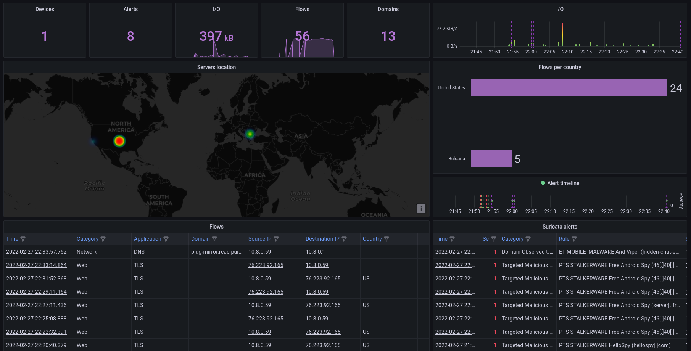
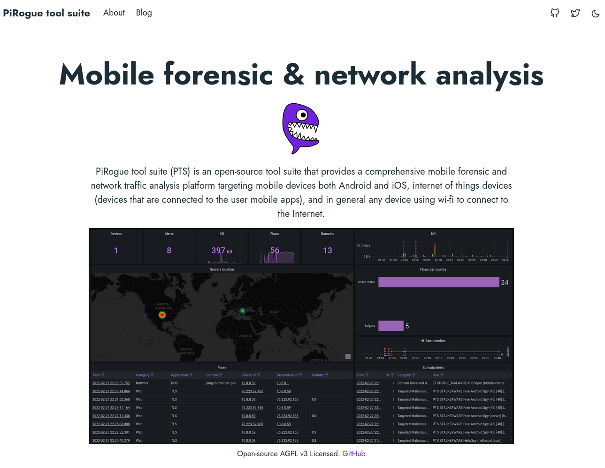

# Context of the project
PiRogue Tool Suite is a reboot of PiRanhaLysis project. Today, PiRanhaLysis is used by a lot of people ranging from universities (the University of Yale as an example), activists, NGOs and gets a lot of traction. Too much traction in fact to be maintained in our spare time as we have done until now. That's why we are looking for funding for PTS. Currently, the project is at the proof-of-concept stage. To get to wider adoption by the general public, we need to streamline the build process and smooth the interface. Our goal is to make the project accessible to anyone.

Here is the beginning of the reboot.

# The project
The problem: the lack of open-source means (hardware + software) to assess both privacy and security of mobile devices. Depending on HRD goals, they should want to educate, conduct emergency assessment or off-the-field investigations.

The plan: As with all the other projects we do, we are the first users of the technologies we develop and we aim to provide open-source, low-cost, well maintained, easy to use and easy to build hardware and software. 

We have three functioning modes for PTS:

- a kiosk mode for anyone who wants to know which servers a mobile device is communicating with
  - useful for non-profit that want to know if a victim is targeted by stalkerware
  - useful for educational purposes to highlight surveillance capitalism
  - more generally assess if a mobile device is spied/compromised by utilizing detection rules such as Suricata and others

- an on-the-field mode
  - for emergency response (active spying, device tampering, ...) useful for responders in repressive environment
  - conduct forensics analysis and network detection using a pre-installed set of tools

- an expert mode for technical people to:
  - determine the list of collected data
  - assess regulatory compliance
  - conduct penetration testing 
  - analyze malware's behavior
  - ensure reproducible analysis
  - generate comprehensive reports

The PiRogue is an open hardware device based on a Raspberry Pi operating as a network router (like any ISP router) analyzing network traffic in real time. 

# What we have done so far
You can check out our work on GitHub at [https://github.com/PiRogueToolSuite/](https://github.com/PiRogueToolSuite/) or on our website at [https://piroguetoolsuite.github.io/](https://piroguetoolsuite.github.io/).

## Hardware
For the moment we have a first version of the PiRogue device with 3D printable case and low cost Raspberry Pi hat. We have sourced enough electronic parts to manufacture 10 PiRogue hats. 
Design and manufacturing documents are not published yet.

**Due to the chip crisis, Raspberry Pi are mostly out of stock.**

### Case design
A 3D printable case has been designed for both Raspberry Pi 3 B+ and Raspberry Pi 4. NB: Raspberry Pi foundation has discontinued the production of the 3 B+ version. 

### Electronic design
A Raspberry Pi hat has been designed. The hat ensures the following functions:

- display various information and alerts on a TFT screen
- provide date and time to the OS based on a [5ppm I²C RTC (Real Time Clock)](https://www.maximintegrated.com/en/products/analog/real-time-clocks/DS3231M.html)
- ensure temperature regulation via a PWM fan control circuit

### Manufacturing
We bought another hot air soldering station and milled an aluminum fixture plate in order to improve the manufacturing process of the PiRogue hats. A poorly edited video showing the milling process is available on Youtube at [https://youtu.be/tSgLxqu3reU](https://youtu.be/tSgLxqu3reU).

## Software
For the moment, we only focused on the software running directly on the PiRogue. 

### PiRogue OS
PiRogue OS is the operating system designed for the PiRogue, it is based on [Raspberry Pi OS](https://www.raspberrypi.com/software/). The [version 1.0.0 beta.7](https://github.com/PiRogueToolSuite/pirogue-os/releases/tag/v1.0.0_beta.7) has been released. The OS image can be downloaded directly from GitHub, unzipped and flashed on a SD-card. 

### Debian packages
In order to update the PiRogue software without having to flash a new image (and losing all your data), we have packaged different parts of the PiRogue software for Debian. Those Debian packages are delivered to the PiRogue via [a PPA hosted on GitHub](https://github.com/PiRogueToolSuite/ppa).

### Network analysis
In its current version, the PiRogue creates a wi-fi access point allowing the user to connect their mobile to it. Once connected, the PiRogue intercept and analyze the network traffic in real time. Traffic inspection is ensured by [NFStream](https://www.nfstream.org/) and [Suricata](https://suricata.io/). All the different information extracted from the network traffic is stored in [InfluxDB](https://www.influxdata.com/).

Suricata is configured to use [Proofpoint Emerging Threat rules](https://www.proofpoint.com) and [PTS rules](https://github.com/PiRogueToolSuite/suricata-rules). The rules are automatically updated on a daily basis. The PiRogue stores 5 days of analysis history.

### Stalkerware detection rules
We have released the first version of a Suricata [rule-set focusing on the stalkerware](https://github.com/PiRogueToolSuite/suricata-rules). Those rules are based on the [IOC list](https://github.com/Te-k/stalkerware-indicators) maintained by [Echap](https://echap.eu.org).

### Dashboard
The PiRogue provides a Grafana dashboard displaying data stored in the local InfluxDB database. The dashboard shows:
* the different network flows and their types
* the Suricata alerts 

and allows you to pivot on IP addresses and alerts. Users can also create their own dashboard.

## Communication

### Graphical design
We started working with [_lila*](https://lila.ink/) on the project's logo and graphical design.

### Website
The project's website is now online. It based on [Hugo](https://gohugo.io/) and is directly hosted on GitHub.

### Demos
Since our work is driven by HRDs and NGOs, we started to organize demo session in order to present them the project and get their feedback. A first demo session has been done with some people working at [OTF](https://www.opentech.fund/).

### Outreach
This project is community driven, to build a community around it, we started working with Misfit on communication strategy. We also started working on a video presenting the project.

# What we plan to do next month
- Publish hardware design and manufacturing documents.
- Document how to build a PiRogue.
- Document how to use a PiRogue.
- Document how we designed the PiRogue software stack.
- Finalize the graphical design and logo.
- Release the presentation video.
- Work on a communication strategy.
- Organize one or two demo sessions.

# What we failed at
PiRogue relies on [NFStream](https://www.nfstream.org/) and because we are bad at cross-compilation, NFStream is compiled during the PiRogue OS build. It is a quick and dirty way to get NFStream working on ARM. We will ask around us if someone could help us in packaging NFStream for `armhf` and `arm64` architecture.

# People we want to thank
* Ramy Raoof - [@RamyRaoof](https://twitter.com/RamyRaoof)
* EntropyQueen - [@entropyqueen_](https://twitter.com/entropyqueen_)
* Christopher Talib
* Herdir - [@Herdir](https://twitter.com/Herdir)
* _lila* - [@lila_bliblu](https://twitter.com/lila_bliblu)
* Tek - [@tenacioustek](https://twitter.com/tenacioustek)